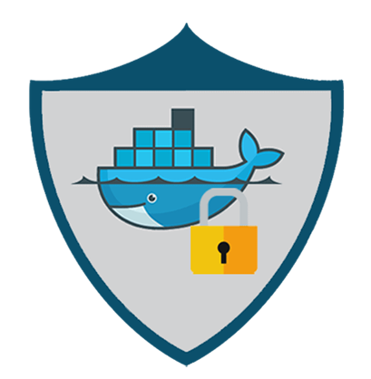
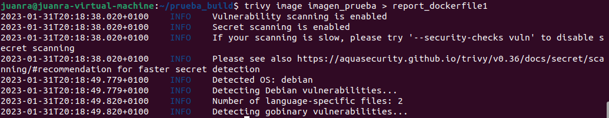
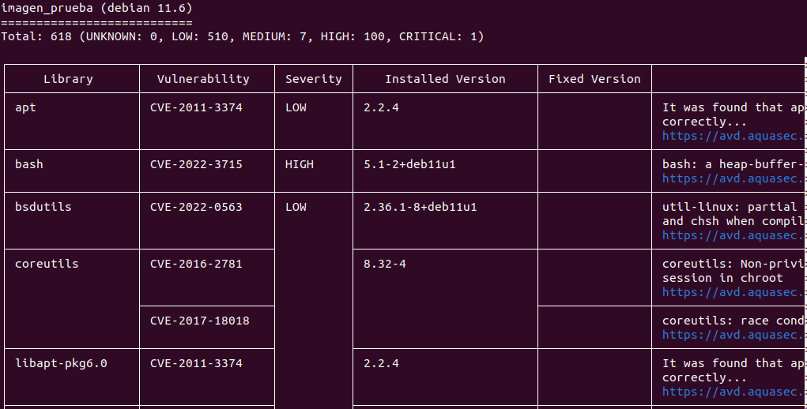

# UT3.- Seguridad y desplegado de aplicaciones con Docker

## Puesta en Producción Segura



# Índice

- [Primera parte: Dockerfile y Docker-Compose](https://www.notion.so/UT3-Seguridad-y-desplegado-de-aplicaciones-con-Docker-bcf898ac0d8b42acb1b8ab00ff1f9f13)
- [Segunda parte: Docker-Bench](https://www.notion.so/UT3-Seguridad-y-desplegado-de-aplicaciones-con-Docker-bcf898ac0d8b42acb1b8ab00ff1f9f13)
    - [1. Utiliza Docker-Bench y realiza un análisis previo de tu Docker.](https://www.notion.so/UT3-Seguridad-y-desplegado-de-aplicaciones-con-Docker-bcf898ac0d8b42acb1b8ab00ff1f9f13)
    - [2. Utiliza AuditD para que analice todas las pruebas de la Sección A, referente al host configuration.](https://www.notion.so/UT3-Seguridad-y-desplegado-de-aplicaciones-con-Docker-bcf898ac0d8b42acb1b8ab00ff1f9f13)
    - [3. Ajustes de seguridad en el Demonio de Docker](https://www.notion.so/UT3-Seguridad-y-desplegado-de-aplicaciones-con-Docker-bcf898ac0d8b42acb1b8ab00ff1f9f13)
    - [4. Reparando warnings](https://www.notion.so/UT3-Seguridad-y-desplegado-de-aplicaciones-con-Docker-bcf898ac0d8b42acb1b8ab00ff1f9f13)
- [Tercera parte: análisis de archivos Dockerfile](https://www.notion.so/UT3-Seguridad-y-desplegado-de-aplicaciones-con-Docker-bcf898ac0d8b42acb1b8ab00ff1f9f13)
- [Cuarta parte: análisis de imágenes](https://www.notion.so/UT3-Seguridad-y-desplegado-de-aplicaciones-con-Docker-bcf898ac0d8b42acb1b8ab00ff1f9f13)

## Primera parte: Dockerfile y Docker-Compose

El requisito mínimo para la entrega de este trabajo es la entrega de las actividades propuestas en Moodle. 

De modo que he decidido subir a este repositorio de GitHub un zip por cada entrega realizada, para que así, quien entre, pueda revisarlas.


## Segunda parte: Docker-Bench

### 1. Utiliza Docker-Bench y realiza un análisis previo de tu Docker.

Para empezar clonamos el repositorio de Docker-Bench:

```bash
git clone https://github.com/docker/docker-bench-security.git
```


Una vez dentro del directorio ejecutamos el script de Docker-Bench:


A continuación nos muestra una checklist con los resultados de la prueba:


### 2. Utiliza AuditD para que analice todas las pruebas de la Sección A, referente al host configuration.

Para poder utilizar AuditD, tenemos que instalarlo primero:

```bash
sudo apt-get install auditd
```


A continuación editamos el fichero  /etc/audit/rules.d/audit.rules y añadimos las siguientes reglas:

```bash
 -w /usr/bin/docker -p wa
 -w /var/lib/docker -p wa
 -w /etc/docker -p wa
 -w /lib/systemd/system/docker.service -p wa
 -w /lib/systemd/system/docker.socket -p wa
 -w /etc/default/docker -p wa
 -w /etc/docker/daemon.json -p wa
 -w /usr/bin/docker-containerd -p wa
 -w /usr/bin/docker-runc -p wa
```


> *“Con “-w” se indica que el fichero debe de ser auditado por “auditd” y “-p wa” indica que se deben generar logs ante cualquier modificación en dichos ficheros o directorios.”*
> 

Una vez añadidas las reglas, reiniciamos AuditD para que las use:

```bash
systemctl restart auditd
```


### 3. Ajustes de seguridad en el Demonio de Docker

En este punto **voy a hacer referencia directamente a la [guía](https://docs.google.com/document/d/1d-84bUAanANefB31evNq3sBaKfmhk65CgfkAxME3I_g/edit)** que nos proporciona el profesor Alejandro. Adjuntado en la siguiente página:

[Ajustes de seguridad en el demonio de Docker](https://www.notion.so/Ajustes-de-seguridad-en-el-demonio-de-Docker-d4bff302bf1f4307bd9a9cbf13f0e146)

Creamos el fichero /etc/docker/daemon.json y le añadimos las opciones de seguridad:

```bash
{

"icc": false,

"userns-remap": "default",

"log-driver": "syslog",

~~"disable-legacy-registry": true,~~

"live-restore": true,

"userland-proxy": false,

"no-new-privileges": true

}
```

Abajo explicamos por qué eliminamos la opción tachada arriba

[Troubleshooting](https://www.notion.so/Troubleshooting-c0e62057f0cc40f986e933304687d0d6)


Una vez guardados los cambios, volvemos a ejecutar Docker-Bench.

Como podemos observar ahora Docker-Bench nos proporciona una puntuación que antes no se veía reflejada:

****Antes:****


**Después:**

> **Importante: reiniciar el servicio de Docker, sobre todo después de cambiar el daemon.json y ejecutar el Docker-Bench como super usuario.**
> 


### 4. Reparando warnings

A continuación vamos a seleccionar dos warnings, y vamos a aplicar una posible solución para cada uno.

- 1.1.4 - Ensure auditing is configured for Docker files and directories -/run/containerd (Automated)


- 1.1.3 - Ensure auditing is configured for the Docker daemon (Automated)
    
    
    

### 4.5

Para la [4.5](https://www.notion.so/UT3-Seguridad-y-desplegado-de-aplicaciones-con-Docker-bcf898ac0d8b42acb1b8ab00ff1f9f13) tenemos que habilitar la variable global DOCKER_CONTENT_TRUST:

```bash
export DOCKER_CONTENT_TRUST=1
```


### 1.1.3

Para la 1.1.3 la solución sería añadir la siguiente línea a las reglas de auditd:

```bash
-w /usr/bin/dockerd -k docker
```

Reiniciamos auditd:

```bash
systemctl restart auditd
```


Vamos a volver a ejecutar el Docker-Bench:


### 1.1.4

Para la 1.1.4 simplemente, añadimos la siguiente línea al fichero /etc/audit/rules.d/audit.rules:

```bash
-w /etc/containerd -p wa
```

Y reiniciamos auditd.

Volvemos a ejecutar el Docker-Bench y esta vez está reparado:


Ahora el resultado es el siguiente:


## Tercera parte: análisis de archivos Dockerfile

Ahora vamos a utilizar Trivy, una herramienta que nos ayudará a la hora de encontrar vulnerabilidades y malas configuraciones en una imagen de docker.

Para su instalación hemos utilizado el siguiente script:

```bash
curl -sfL https://raw.githubusercontent.com/aquasecurity/trivy/main/contrib/install.sh | sh -s -- -b /usr/local/bin v0.36.1
```


Una vez instalado, ejecutamos Trivy para que analice la imagen construida a partir de mi Dockerfile:



El escáner de vulnerabilidades nos muestra las siguientes estadísticas:


## Cuarta parte: análisis de imágenes

### Mi Wordpress

Probamos Trivy con la [imagen](https://hub.docker.com/r/sh4rkbit3/wordpress) que creé de Wordpress:


En este caso la prueba la realizaremos en un Docker Desktop de Windows:


Como podemos ver arriba, tenemos varias vulnerabilidades, de entre ellas, nueve son críticas.

### Wordpress:4.6

Escaneamos con Trivy como hicimos con la otra imagen:


En este caso se han encontrado muchas vulnerabilidades críticas.

Es bastante probable que la diferencia en el número de vulnerabilidades entre una imagen y otra se deba a que la versión que yo usé de WordPress es la actual y las vulnerabilidades presentes se deban a la manera de construir el dockercompose.yml.

Como podemos observar ambos comparten vulnerabilidades de apache, atendiendo a lo anteriormente dicho, mi WordPress tiene vulnerabilidades de apache de 2022, mientras que el 4.6 tiene vulnerabilidades de apache del 2017.

Con todo esto podemos concluir que WordPress, aunque pueda securizarse, a priori es una aplicación muy vulnerable hoy en día y conviene tenerlo actualizado.